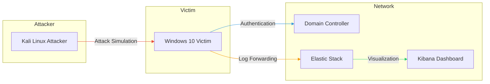

```mermaid
graph LR
    subgraph Attacker
        A[Kali Linux Attacker]
    end

    subgraph Victim
        B[Windows 10 Victim]
    end

    subgraph Network
        C[Domain Controller]
        D[Elastic Stack]
        E[Kibana Dashboard]
    end

    A -->|Attack Simulation| B
    B -->|Authentication| C
    B -->|Log Forwarding| D
    D -->|Visualization| E

    linkStyle 0 stroke:#e74c3c,stroke-width:2px  %% Red - attack
    linkStyle 1 stroke:#3498db,stroke-width:2px  %% Blue - auth
    linkStyle 2 stroke:#f39c12,stroke-width:2px  %% Orange - logs
    linkStyle 3 stroke:#2ecc71,stroke-width:2px  %% Green - visualization
```
